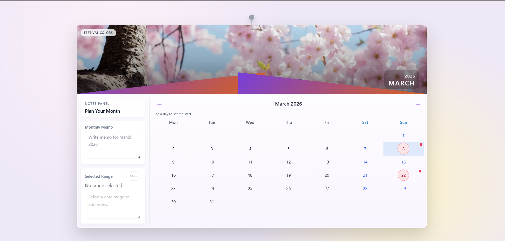
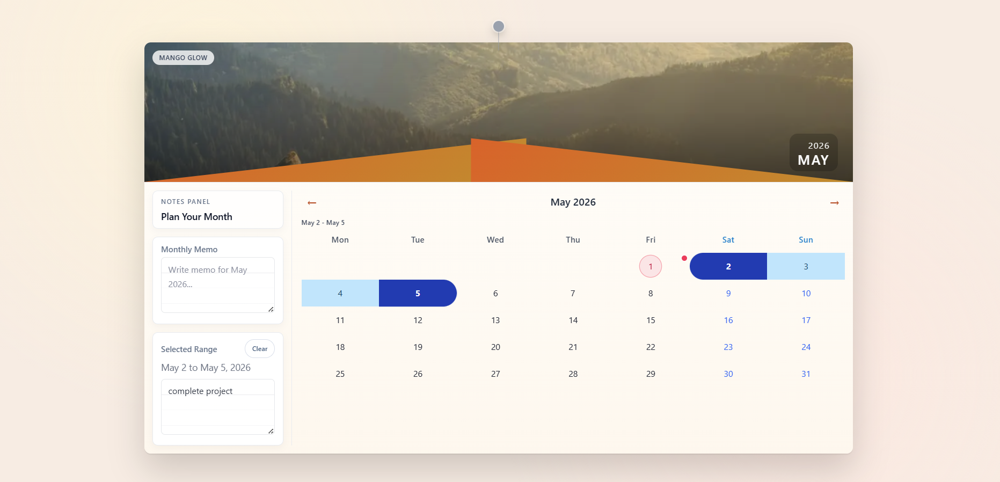
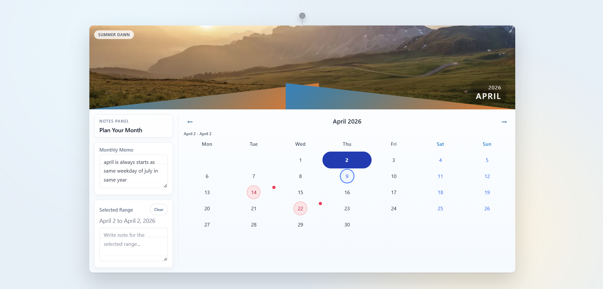
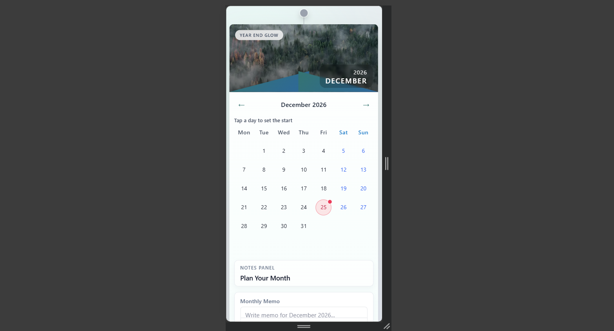

# Overview

This project is an interactive calendar component built using Next.js (React) and Tailwind CSS. The goal was to recreate a physical wall calendar UI while adding useful interactive features like date range selection and note-taking.

I focused on building a clean, responsive, and user-friendly interface while also following good frontend engineering practices such as component separation and modular code structure.

## Features

### 📅 Wall Calendar UI

- Inspired by a physical hanging calendar design
- Includes a hero image and structured layout

### 🔵 Date Range Selection

- Users can select a start and end date
- Selected range is visually highlighted with smooth styling

### 📝 Notes System

- Monthly notes
- Notes for selected date ranges
- Data is stored using localStorage

### 📱 Responsive Design

- Works across desktop and mobile devices
- Layout adapts from side-by-side to stacked

### 🎨 Dynamic Themes

- Each month has a different visual theme and image

### 🎯 Extra Enhancements

- Holiday markers
- "Today" indicator
- Smooth animations and hover effects

## Screenshots

Add your project screenshots here to show the UI in action. Place the image files in `public/screenshots/` and keep the names below, or update the paths to match your files.

### 1. Home Screen



### 2. Date Range Selection



### 3. Notes Panel



### 4. Mobile View



## Tech Stack

- Next.js (React)
- TypeScript
- Tailwind CSS
- LocalStorage (for persistence)

## Project Structure

I followed a feature-based structure to keep the code modular and scalable:

```txt
features/calendar/
components/ -> UI components
hooks/ -> state and logic (custom hooks)
utils/ -> reusable functions
types/ -> TypeScript types
```

This separation helps in maintaining clean code and makes the project easier to extend.

## How to Run Locally

Clone the repository:

```bash
git clone
```

Navigate to the project folder:

```bash
cd interactive-calendar-component
```

Install dependencies:

```bash
npm install
```

Run the development server:

```bash
npm run dev
```

Open in browser:

```txt
http://localhost:3000
```

## Key Decisions

* **Tailwind CSS for Styling**
  I chose Tailwind CSS to build the UI quickly while maintaining consistency in spacing, colors, and responsiveness. It also helped me keep styles close to components instead of managing separate CSS files.

* **Feature-Based Architecture**
  I organized the project using a feature-based structure (`features/calendar`) to keep all related components, hooks, and utilities together. This improves scalability and makes the code easier to maintain as the project grows.

* **Separation of Concerns**
  I separated UI components, business logic, and utility functions:

  * Components handle only rendering (UI)
  * Custom hooks manage state and logic
  * Utility functions handle reusable calculations
  This keeps the code clean and easier to debug or extend.

* **Custom Hook for State Management**
  Instead of keeping all logic inside a single component, I used a custom hook (`useCalendar`) to manage state like selected range, current month, and notes. This makes the main component simpler and more readable.

* **LocalStorage for Persistence**
  Since the project is frontend-only, I used `localStorage` to persist notes. This allows users to retain their data without needing a backend.

* **Date Range Selection Logic**
  I implemented normalized range selection (start and end dates are automatically ordered). This ensures consistent behavior even if the user selects dates in reverse order.

* **Responsive Design Approach**
  The layout adapts based on screen size:

  * Desktop: side-by-side layout (notes + calendar)
  * Mobile: stacked layout
  This ensures usability across devices.

* **Reusable Utility Functions**
  Functions like generating the calendar grid and handling date logic are extracted into utility files. This improves reusability and keeps components focused on UI.

* **Accessibility Considerations**
  I added ARIA attributes and ensured interactive elements (like date cells) are accessible and provide proper feedback.

* **UI/UX Focus**
  I focused on subtle animations, clear visual hierarchy, and intuitive interactions (like range highlighting and notes feedback) to make the component feel more like a real product.

## Final Thoughts

This project helped me improve both UI design and frontend architecture skills. I focused not just on building features, but also on writing clean and maintainable code.
